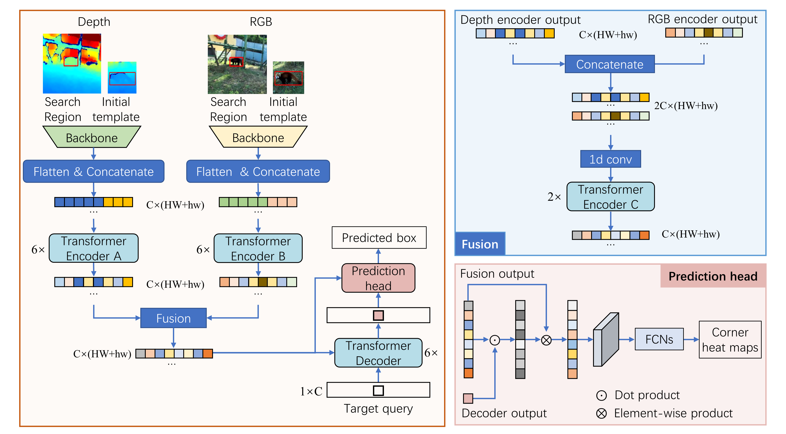

# RGBD1K: A Large-Scale Dataset and Benchmark for RGB-D Object Tracking [AAAI2023]

The official implementation of the SPT tracker of the [**AAAI2023**] paper [**RGBD1K: A Large-Scale Dataset and Benchmark for RGB-D Object Tracking**](https://ojs.aaai.org/index.php/AAAI/article/view/25500)

<center></center>

## Usage
### Installation

Install the environment using Anaconda
```
conda create -n spt python=3.6
conda activate spt
bash install_pytorch17.sh
```

### Data Preparation
The training dataset is the [**RGBD1K**](https://github.com/xuefeng-zhu5/RGBD1K)
```
--RGBD1K
    |--Adapter
        |--adapter1
        |--adapter2
        ...
    |--Animal
       |--alpaca1
       |--bear1
        ...
    ... 
```

### Set project paths
Run the following command to set paths for this project
```
python tracking/create_default_local_file.py --workspace_dir . --data_dir ./data --save_dir .
```

After running this command, you can also modify paths by editing these two files
```
lib/train/admin/local.py  # paths about training
lib/test/evaluation/local.py  # paths about testing
```
### Training
Dowmload the pretrained [Stark-s model](https://drive.google.com/drive/folders/142sMjoT5wT6CuRiFT5LLejgr7VLKmaC4)
and put it under ./pretrained_models/.
Set the MODEL.PRETRAINED path in ./experiments/spt/rgbd1k.yaml

Training with multiple GPUs using DDP (4 RTX3090Ti with batch size of 16)
```
export PYTHONPATH=/path/to/SPT:$PYTHONPATH
python -m torch.distributed.launch --nproc_per_node=4 ./lib/train/run_training.py  
```

### Test
Edit ./lib/test/evaluation/local.py to set the test set path, then run
```
python ./tracking/test.py
```

## Acknowledgment
- This repo is based on [Stark](https://github.com/researchmm/Stark) which is an excellent work.

## Contact
If you have any question, please feel free to [contact us](xuefeng_zhu95@163.com)(xuefeng_zhu95@163.com)
